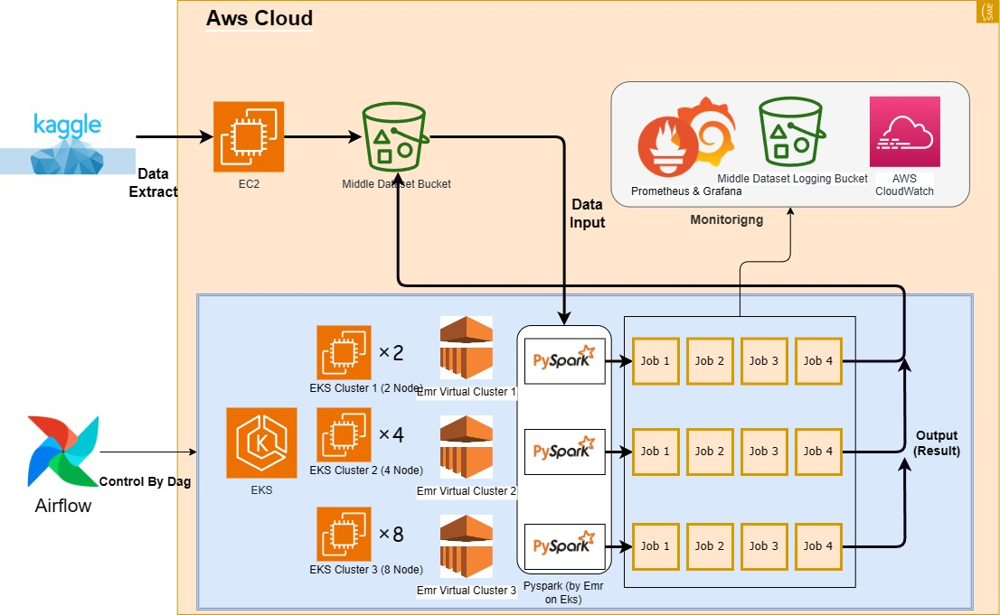

# MiddleSizeDataDistributedProcessing
실제 프로젝트에서 중간 규모(50 GB 내외)의 데이터를 처리 해야할 일이 종종 발생합니다.
하지만, 중간 규모의 데이터는 단일 노드에서 진행하기엔 크고, 대규모 클러스터에서 처리하기엔 너무 작습니다.
이런 상황에 필요한 것이 중간 규모의 클러스터입니다.

이 프로젝트에서는 세 종류의 EKS 클러스터를 구성해 중간 규모의 데이터를 EMR on Eks(Pyspark)를 통해 처리하는데 속도적, 비용적으로 적합한 클러스터 구성, 스파크 자원 분배율을 튜닝합니다.
또한, 이 튜닝 과정을 Airflow를 통해 관리합니다.

1. 중간 규모의 데이터셋의 효율적인 처리를 위한 튜닝
2. Eks 생성 -> EMR on Eks Job 실행 -> Prometheus를 통해 지표 측정 -> 지표를 바탕으로 튜닝
3. 간단하고 병렬적인 튜닝을 위한 Airflow를 통한 스케쥴링 (클러스터의 생성, Job 실행, 지표 측정, 클러스터의 삭제)

#  구조
.
## 데이터셋
https://www.kaggle.com/datasets/bwandowando/strong-passwords-in-rockyou2024-txt

History: https://en.wikipedia.org/wiki/RockYou

캐글에서 제공하는 utf-8으로 인코딩된 암호를 데이터로 하는 Rockyou 데이터셋을 사용합니다. 총 160GB의 데이터지만 이번 프로젝트에서는 50GB의 데이터만을 사용합니다.
## 데이터 흐름
1. ec2노드에서 파이썬 캐글 API 통해 캐글에서 데이터셋을 수집합니다.
2. boto3 aws api로 s3에 데이터셋 저장합니다.
3. EMR on EKS Pyspark로 s3에 저장된 데이터 읽어와 처리합니다.
4. 각각의 잡을 실행 후 사용된 시간, cpu, 메모리, 네트워크 IO를 프로메테우스 쿼리를 통해 지표측정 후 저장합니다.
5. 데이터 처리 결과를 s3 버켓에 저장합니다.

## 클러스터 튜닝
1. 세 개의 eks 클러스터를 생성합니다.
2. 각각의 eks 클러스터에서 emr 가상 클러스터를 생성합니다.
3. 각 Emr 가상 클러스터에 Emr on Eks 잡을 실행합니다. 각 클러스터에서 4번의 잡을 실행해 총 12개의 잡이 실행됩니다.
4. 각각의 잡 실행 후, 메트릭을 프로메테우스를 통해 수집하여 s3에 저장합니다.
5. 모든 잡이 종료된 클러스터부터 삭제합니다.
5. 1~5 과정을 Airflow dag를 통해 자동화합니다.
6. 수집된 지표를 통해 클러스터의 구성과 스파크 잡의 리소스 구성을 튜닝합니다.

## Job
잡은 잡에서 실행되는 테스크의 종류, 데이터의 양에 따라 4종류로 구분되어 있습니다.
- 테스크1: 간단한 테스크 - 텍스트의 첫글자에 따라 그룹 후 갯수를 카운트
- 테스크2: 비교적 복잡한 테스크 - 텍스트가 *강한 암호에 맞는지 검사 후, 강한 암호의 수를 세기
  (* 강한 암호 : 8 ~ 32 글자,1개 이상의 대문자,  1개 이상의 소문자,  1개 이상의 숫자,  1개 이상의 특수문자,  사전에 등재된 단어 아님)
- 5GB 데이터: 데이터의 일부
- 50GB 데이터: 전체 데이터

### Job 종류 
1. Job1: 테스크1, 5기가 데이터
2. Job2: 테스크2, 5기가 데이터
3. Job3: 테스크1, 50기가 데이터
4. Job4: 테스크2, 50기가 데이터

# 성과
1. 50기가 데이터에 적합한 eks 클러스터 구성, 스파크 리소스 분배구성을 찾을 수 있었습니다.
2. Emr on Eks를 통해 분산처리를 통해 진행했기에 빠른 실행,  실제 호스트머신의 스펙에 관계 없이 사용, 병렬적으로 실행, 간단한 설치와 삭제가 가능합니다.
3. Airflow로 eks 설치부터 실행,삭제까지 관리하므로 end to end이면서 동시에 확장적인 설계가 가능했습니다.

# 결과
m5.xlarge : 0.236 달러/h

# 프로젝트 구현 과정

1. **프로젝트 기획** `[2024-09-02]`
   1. 문제 제기 `[2024-09-02]`
   2. 문제 해결 방법 고안 `[2024-09-02]`
   3. 데이터 선정 `[2024-09-02]`
   4. 프로젝트 기한 설정 `[2024-09-02]`
   5. 깃허브 레포지토리 구성 `[2024-09-03]`
   6. S3 버켓 관리, EMR on EKS 수행용 AWS IAM 사용자 생성, 액세스 키 발급 `[2024-09-03]`

2. **데이터 수집** `[2024-09-03]`
   1. 데이터 저장용 S3 버켓 생성 `[2024-09-03]`
   2. 캐글 데이터 사용 `[2024-09-03]`
   3. 캐글 토큰 발급 `[2024-09-04]`
   4. 캐글 API로 데이터 수집 및 S3에 전송 `[2024-09-04]`

3. **데브 프로젝트 환경 구성** `[2024-09-04]`
   1. 도커 컴포즈 스탠드얼론 PySpark 구성 `[2024-09-04]`
   2. 원본 데이터의 약 1만분의 1 크기의 데브 데이터셋 생성 및 S3에 저장

4. **비즈니스 로직 구성**
   1. 테스크 1 로직 구성 `[2024-09-05]`
   2. 테스크 2 로직 구성 `[2024-09-05]`

5. **오프라인 평가 지표 구성**
   1. 프로젝트에 사용할 구체적인 평가 지표 구성 `[2024-09-06]`
   2. 속도, 리소스 소모량, 가격 측정, 활동중인 엑서큐터 비율 - `[2024-09-14]`

6. **에어플로우 워크로드 구성**
   1. DAG 구현 `[2024-09-07]`
   2. 2개의 엑서큐터를 가진 EKS 클러스터 구성 `[2024-09-07]`
   3. 4개의 잡 실행 `[2024-09-09]`

7. **데브 프로젝트 실행 및 디버깅**
   1. 스탠드얼론 PySpark에서 두 테스크 실행 및 디버깅 `[2024-09-07]`
   2. 오프라인 평가 지표로 데브 프로젝트 평가 `[2024-09-09]`

8. **프로젝트 환경 구성**
   1. DAG 구현 `[2024-09-10]`
   2. 2개, 4개, 8개의 엑서큐터를 지닌 EKS 클러스터 생성, 잡 실행 후 삭제 `[2024-09-10]`
   3. 각 클러스터에서 4개의 잡 실행 `[2024-09-10]`

9. **프로젝트 실행 및 디버깅**
   1. 데브 데이터셋으로 프로젝트 실행 및 디버깅 `[2024-09-12]`
   2. 전체 데이터셋으로 프로젝트 실행 및 디버깅, 평가지표 기록 및 결과 작성 `[2024-09-12]` `[2024-09-14]`

10. **문서 작성**
    1. 프로젝트 데이터 흐름 아키텍처 [draw.io](http://draw.io) `[2024-09-13]`
    2. 각각의 EKS 클러스터 스펙 아키텍처 [draw.io](http://draw.io) `[2024-09-13]`
    3. 리드미 작성 `[2024-09-14]`

## 깃 컨벤션
| Tag Name         | Description                                                                                   |
| ---------------- | --------------------------------------------------------------------------------------------- |
| Feat             | 새로운 기능을 추가                                                                            |
| Fix              | 버그 수정                                                                                     |
| Design           | CSS 등 사용자 UI 디자인 변경                                                                  |
| !BREAKING CHANGE | 커다란 API 변경의 경우                                                                        |
| !HOTFIX          | 급하게 치명적인 버그를 고쳐야하는 경우                                                        |
| Style            | 코드 포맷 변경, 세미 콜론 누락, 코드 수정이 없는 경우                                         |
| Refactor         | 프로덕션 코드 리팩토링                                                                        |
| Comment          | 필요한 주석 추가 및 변경                                                                      |
| Docs             | 문서 수정                                                                                     |
| Test             | 테스트 코드, 리펙토링 테스트 코드 추가, Production Code(실제로 사용하는 코드) 변경 없음       |
| Chore            | 빌드 업무 수정, 패키지 매니저 수정, 패키지 관리자 구성 등 업데이트, Production Code 변경 없음 |
| Rename           | 파일 혹은 폴더명을 수정하거나 옮기는 작업만인 경우                                            |
| Remove           | 파일을 삭제하는 작업만 수행한 경우                                                            |
