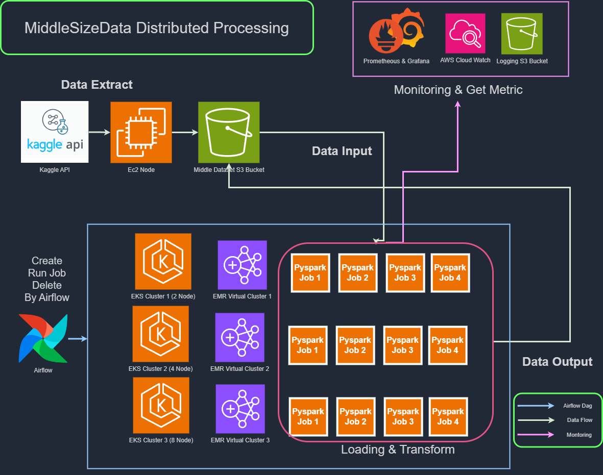

# MiddleSizeDataDistributedProcessing

실제 프로젝트에서 중간 규모(50GB 내외)의 데이터를 처리해야 할 일이 종종 발생합니다. 하지만 중간 규모의 데이터는 단일 노드에서 처리하기에는 크고, 대규모 클러스터에서 처리하기에는 너무 작습니다. 이러한 상황에서는 중간 규모의 클러스터가 필요합니다.

이 프로젝트에서는 세 종류의 EKS 클러스터를 구성하여 중간 규모의 데이터를 EMR on EKS(PySpark)를 통해 처리합니다. 이 과정에서 속도와 비용 측면에서 최적의 클러스터 구성과 스파크 자원 분배를 튜닝하여 찾습니다. 이 모든 과정을 Airflow를 통해 간단히 병렬적으로 관리합니다.

- 중간 규모 데이터셋의 효율적인 처리를 위한 튜닝
- EKS 생성 → EMR on EKS 작업 실행 → Prometheus를 통해 메트릭 측정 → 메트릭을 바탕으로 튜닝
- 간단하고 병렬적인 튜닝을 위한 Airflow를 통한 스케줄링 (클러스터의 생성, 작업 실행, 메트릭 측정, 클러스터의 삭제)

# 구조

## 구조 - 데이터 흐름 관점

1. EC2 노드에서 파이썬 캐글 API를 통해 데이터셋을 수집합니다.
2. boto3 AWS API로 S3에 데이터셋을 저장합니다.
3. EMR on EKS PySpark로 S3에 저장된 데이터를 읽어와 처리합니다.
4. 각 작업 실행 후 사용된 시간, CPU, 메모리, 네트워크 IO, Executor의 상태를 Prometheus 쿼리를 통해 메트릭을 측정하여 S3에 저장합니다.
5. 데이터 처리 결과를 S3 버킷에 저장합니다.

## 구조 - 클러스터 튜닝 흐름 관점

1. 세 개의 EKS 클러스터를 생성합니다.
2. 각 EKS 클러스터에서 EMR 가상 클러스터를 생성합니다.
3. 각 EMR 가상 클러스터에서 EMR on EKS 작업을 실행합니다. 각 클러스터에서 4번의 작업을 실행하여 총 12개의 작업이 실행됩니다.
4. 각 작업 실행 후, 메트릭을 Prometheus를 통해 수집하여 S3에 저장합니다.
5. 모든 작업이 종료된 클러스터부터 삭제합니다.
6. 1~5 과정을 Airflow DAG를 통해 자동화합니다.
7. 수집된 메트릭을 통해 스파크 작업의 리소스 구성을 튜닝합니다.

## 구조 - 클러스터 구성 관점

1. EKS Cluster 1 - AWS EC2 m5.xlarge x 2
2. EKS Cluster 2 - AWS EC2 m5.xlarge x 4
3. EKS Cluster 3 - AWS EC2 m5.xlarge x 8
4. Airflow - AWS EC2 t3.large x 1

## 작업

작업은 실행되는 태스크의 종류와 데이터의 양에 따라 4종류로 구분됩니다.

### 작업 종류

1. **작업1**: 태스크1, 5GB 데이터
2. **작업2**: 태스크2, 5GB 데이터
3. **작업3**: 태스크1, 50GB 데이터
4. **작업4**: 태스크2, 50GB 데이터

- **태스크1**: 간단한 태스크 - 텍스트의 첫 글자에 따라 그룹 후 개수를 카운트
- **태스크2**: UDF가 포함된 복잡한 태스크 - 텍스트가 *강한 암호에 부합하는지 검사 후, 강한 암호의 수를 세기
  (*강한 암호: 8~32자, 1개 이상의 대문자, 1개 이상의 소문자, 1개 이상의 숫자, 1개 이상의 특수문자, 사전에 등재되지 않은 단어)
- **5GB 데이터**: 데이터의 일부
- **50GB 데이터**: 전체 데이터

### 데이터셋

[Strong Passwords in Rockyou2024.txt](https://www.kaggle.com/datasets/bwandowando/common-password-list-rockyou2024-txt)

히스토리: [RockYou 위키피디아](https://en.wikipedia.org/wiki/RockYou)

캐글에서 제공하는 UTF-8로 인코딩된 암호 데이터인 Rockyou 데이터셋을 사용합니다. 총 160GB의 데이터 중 이번 프로젝트에서는 50GB를 사용합니다.

# 성과
## 성과요약
- EKS 클러스터의 확장을 통해, 거의 동일한 가격으로 UDF가 사용된 잡4의 수행시간을 1/4로 감소 시켰습니다.
- Airflow DAG화를 통해, EKS 설치와 삭제에 들어가는 시간이 1/3 ~ 1/9로 단축되었습니다
- 50GB 데이터 처리에 적합한 EKS 클러스터 구성, 스파크 리소스 분배구성을 찾을 수 있었습니다
   - 코어의 개수, 메모리 할당, 엑서큐터의 수는 수행속도에 절대적인 영향을 끼치는 것을 알 수 있습니다.
   - 펜딩을 일으킬 정도로 많이 할당하면 오히려 손해를 보게 됩니다.
   - 같은 구성의 클러스터에서 스파크 엑서큐터에 할당하는 코어를 늘렸음에도 이로 인해 일부 엑서큐터가 펜딩된다면, 오히려 성능에 부작용이 발생하는 것을 확인했습니다.
   - 따라서, 동일한 ec2 스펙의 클러스터를 구성한다면 **노드의 개수를 8개 이상 늘리고 펜딩되는 엑서큐터가 없는 선에서 코어와 메모리를 충분히 주어 빠르게 끝내는 편**이 속도적, 경제적으로 가장 효율적인 구성입니다.

## 클러스터 튜닝
### 스파크 리소스 분배 튜닝
[튜닝 구성 - tunning-n.json](airflow/config)

| Tuning    | Driver Core | Driver Memory | Executor Core | Executor Memory | Executor Count   |
|-----------|-------------|---------------|---------------|----------------|------------------|
| Tuning-1  | 1           | 4             | 2             | 4              | Node Count       |
| Tuning-2  | 1           | 4             | 2             | 2              | Node Count       |
| Tuning-3  | 1           | 4             | 1             | 2              | Node Count * 2   |
| Tuning-4  | 1           | 4             | 3             | 4              | Node Count       |

### 튜닝 결과
[튜닝 결과](results)

- **작업4에 대한 각 튜닝 결과 집계 중 일부**

| Cluster Name   | Tuning Version | Job Name | Time * Money | Spend Time (s) | Spend Money ($) | AVG CPU (%) | MAX CPU (%) | Total vCPU Usage (s) | AVG Memory (%) | MAX Memory (%) | Pending Executor | Running Executor |
|----------------|----------------|----------|--------------|----------------|----------------|-------------|-------------|----------------------|----------------|----------------|------------------|-----------------|
| mid-cluster-3  | 1              | job_4    | 1013.3       | 1390           | 0.729          | 60          | 71          | 2681K                | 21             | 25             | 0                | 8               |
| mid-cluster-3  | 3              | job_4    | 1151.5       | 1482           | 0.777          | 60          | 84          | 2872K                | 24             | 35             | 0                | 16              |
| mid-cluster-3  | 4              | job_4    | 1726.1       | 1815           | 0.951          | 62          | 85          | 3611K                | 17             | 22             | 2                | 6               |
| mid-cluster-2  | 1              | job_4    | 1895.7       | 2689           | 0.705          | 63          | 72          | 2739K                | 23             | 28             | 0                | 4               |
| mid-cluster-2  | 3              | job_4    | 2253.9       | 2931           | 0.769          | 62          | 86          | 2923K                | 25             | 35             | 0                | 8               |
| mid-cluster-3  | 2              | job_4    | 3046.7       | 2418           | 1.26           | 31          | 67          | 2417K                | 21             | 35             | 0                | 8               |
| mid-cluster-1  | 3              | job_4    | 3554.4       | 5227           | 0.68           | 65          | 72          | 2745K                | 29             | 33             | 0                | 4               |
| mid-cluster-1  | 1              | job_4    | 3663.2       | 5286           | 0.693          | 65          | 76          | 2755K                | 26             | 27             | 0                | 2               |
| mid-cluster-2  | 2              | job_4    | 5169.3       | 4441           | 1.164          | 32          | 38          | 2321K                | 23             | 27             | 0                | 4               |
| mid-cluster-2  | 4              | job_4    | 6839.6       | 5108           | 1.339          | 44          | 87          | 3596K                | 15             | 22             | 2                | 2               |
| mid-cluster-1  | 2              | job_4    | 14315.1      | 10449          | 1.37           | 34          | 72          | 2842K                | 26             | 40             | 0                | 2               |
| mid-cluster-1  | 4              | -        | -            | -              | -              | -           | -           | -                    | -              | -              | -                | -               |

- **50GB 데이터 처리에 적합한 EKS 클러스터 구성과 스파크 리소스 분배 구성을 찾았습니다.**

1. 중간 규모(50GB)의 데이터라도 복잡한 태스크라면 노드 개수의 증가가 실행 시간을 비례적으로 감소시켰습니다.
   - 즉, 네트워크 IO로 인한 오버헤드보다 이득이 더 컸습니다.
   - 작업4의 수행 시간: 5,286초 → 2,689초 → 1,390초
2. 튜닝 1, 2, 3의 결과를 통해 코어의 개수, 메모리 할당, Executor의 수가 수행 속도에 직접적인 영향을 미치는 것을 알 수 있습니다.
   - 단, 대기를 유발할 정도로 자원을 많이 할당하면 오히려 손해를 봅니다.
   - 튜닝4의 클러스터1은 모든 Executor가 펜딩 상태여서 작업을 수행하지 못했습니다.
   - 튜닝4-클러스터3-작업4의 경우, 코어를 2에서 3으로 늘렸지만 2개의 Executor가 대기되어 수행 속도가 느려졌습니다.
3. 태스크가 충분히 복잡하다면 노드의 개수를 최대한 늘리는 편이 비용은 비슷하지만 수행 시간은 최대 4배까지 단축되었습니다.
4. 튜닝 1과 3을 비교하면, 코어(2), Executor(2, 4, 8)과 코어(1), Executor(4, 8, 16)은 수행 시간에 큰 차이가 없었습니다.
   - 이 프로젝트의 작업에서는 코어와 Executor의 수가 동등한 가치의 자원으로 판단되었습니다.
5. 따라서, 태스크가 복잡하고 동일한 EC2 스펙의 클러스터를 구성한다면, 노드의 개수를 8개 이상으로 늘리고 펜딩되는 Executor가 없도록 코어와 메모리를 충분히 할당하여 빠르게 처리하는 편이 효율적입니다.

## Task Result
- Task 1

| First Letter |      Count |
|:-------------|-----------:|
| 0            |  423476338 |
| 1            |  321868559 |
| 2            |  241503290 |
| 3            |  209654479 |
| 4            |  229436433 |
| 5            |  252486601 |
| 6            |  179215213 |
| 7            |  182780303 |
| 8            |  186907480 |
| 9            |  182356779 |
| A            |  183889378 |
| a            |  377568257 |

- Task 2
  - StrongPassword: 27,122,300
  - total: 2,971,143,110

- run job Dag 예시

## 향상된 역랑

- Airflow Dag 구현, 동작방식에 대해 이해했으며, 테스크 그룹을 통한 병렬 실행 기능, Xcom을 통한 변수 전달 기능을 사용할 수 있게 되었습니다.
- EMR on EKS의 모니터링, 프로메테우스와 그라파나를 통한 모니터링 능력이 향상되었습니다.

## 느낀점

- 학습곡선이 높았지만 추후에 있을 프로젝트에서 아주 유용하게 사용할 수 있는 기반을 다진 것 같아 큰 성취감 느꼈습니다.
- 엑서큐터가 펜딩된다면 구체적으로 어떠한 자원이 어느 정도 부족한 지 알 수 있게끔 코드를 작성하고 싶었으나 작업 시간의 부족으로 구현하지 못 해서 아쉬움을 느꼈습니다. 
- 엑서큐터와 드라이버에 할당된 파드들이 할당된 자원 대비 실제 작업에서 구체적으로 어느 정도의 자원을 사용하는지 파악하고 싶었으나, k8s, 프로메테우스에 대한  이해도가 부족하여 파악하지 못 해 큰 아쉬움을 느꼈습니다.
- 추후에 있을 다음 프로젝트 혹은 이 프로젝트의 발전에선, 앞선 두개의 기능 구현과 더불어, Airflow DAG 코드의 가독성, 재사용성을 높일 계획입니다.

## 기여도
모든 기획과 개발을 혼자 진행한 개인 프로젝트입니다.

# 프로젝트 기간 및  구현 과정
기간 : 2024-09-02 ~ 2024-09-14

1. **프로젝트 기획** `[2024-09-02]`
   1. 문제 제기 `[2024-09-02]`
   2. 문제 해결 방법 고안 `[2024-09-02]`
   3. 데이터 선정 `[2024-09-02]`
   4. 프로젝트 기한 설정 `[2024-09-02]`
   5. 깃허브 레포지토리 구성 `[2024-09-03]`
   6. S3 버켓 관리, EMR on EKS 수행용 AWS IAM 사용자 생성, 액세스 키 발급 `[2024-09-03]`

2. **데이터 수집** `[2024-09-03]`
   1. 데이터 저장용 S3 버켓 생성 `[2024-09-03]`
   2. 캐글 데이터 사용 `[2024-09-03]`
   3. 캐글 토큰 발급 `[2024-09-04]`
   4. 캐글 API로 데이터 수집 및 S3에 전송 `[2024-09-04]`

3. **데브 프로젝트 환경 구성** `[2024-09-04]`
   1. 도커 컴포즈 스탠드얼론 PySpark 구성 `[2024-09-04]`
   2. 원본 데이터의 약 1만분의 1 크기의 데브 데이터셋 생성 및 S3에 저장

4. **비즈니스 로직 구성**
   1. 테스크 1 로직 구성 `[2024-09-05]`
   2. 테스크 2 로직 구성 `[2024-09-05]`

5. **오프라인 평가 지표 구성**
   1. 프로젝트에 사용할 구체적인 평가 지표 구성 `[2024-09-06]`
   2. 속도, 리소스 소모량, 가격 측정, 활동중인 엑서큐터 비율 - `[2024-09-14]`

6. **에어플로우 워크로드 구성**
   1. DAG 구현 `[2024-09-07]`
   2. 2개의 엑서큐터를 가진 EKS 클러스터 구성 `[2024-09-07]`
   3. 4개의 잡 실행 `[2024-09-09]`

7. **데브 프로젝트 실행 및 디버깅**
   1. 스탠드얼론 PySpark에서 두 테스크 실행 및 디버깅 `[2024-09-07]`

8. **프로젝트 환경 구성**
   1. DAG 구현 `[2024-09-10]`
   2. 2개, 4개, 8개의 엑서큐터를 지닌 EKS 클러스터 생성, 잡 실행 후 삭제 `[2024-09-10]`
   3. 각 클러스터에서 4개의 잡 실행 `[2024-09-10]`

9. **프로젝트 실행 및 디버깅**
   1. 데브 데이터셋으로 프로젝트 실행 및 디버깅 `[2024-09-12]`
   2. 전체 데이터셋으로 프로젝트 실행 및 디버깅, 평가지표 기록 및 결과 작성 `[2024-09-12]` ~ `[2024-09-14]`

10. **문서 작성**
    1. 프로젝트 데이터 흐름 아키텍처  `[2024-09-13]`
    2. 각각의 EKS 클러스터 스펙 아키텍처 `[2024-09-13]`
    3. 리드미 작성 `[2024-09-14]`

## 깃 컨벤션
| Tag Name         | Description                                                                                   |
| ---------------- | --------------------------------------------------------------------------------------------- |
| Feat             | 새로운 기능을 추가                                                                            |
| Fix              | 버그 수정                                                                                     |
| Design           | CSS 등 사용자 UI 디자인 변경                                                                  |
| !BREAKING CHANGE | 커다란 API 변경의 경우                                                                        |
| !HOTFIX          | 급하게 치명적인 버그를 고쳐야하는 경우                                                        |
| Style            | 코드 포맷 변경, 세미 콜론 누락, 코드 수정이 없는 경우                                         |
| Refactor         | 프로덕션 코드 리팩토링                                                                        |
| Comment          | 필요한 주석 추가 및 변경                                                                      |
| Docs             | 문서 수정                                                                                     |
| Test             | 테스트 코드, 리펙토링 테스트 코드 추가, Production Code(실제로 사용하는 코드) 변경 없음       |
| Chore            | 빌드 업무 수정, 패키지 매니저 수정, 패키지 관리자 구성 등 업데이트, Production Code 변경 없음 |
| Rename           | 파일 혹은 폴더명을 수정하거나 옮기는 작업만인 경우                                            |
| Remove           | 파일을 삭제하는 작업만 수행한 경우                                                            |
